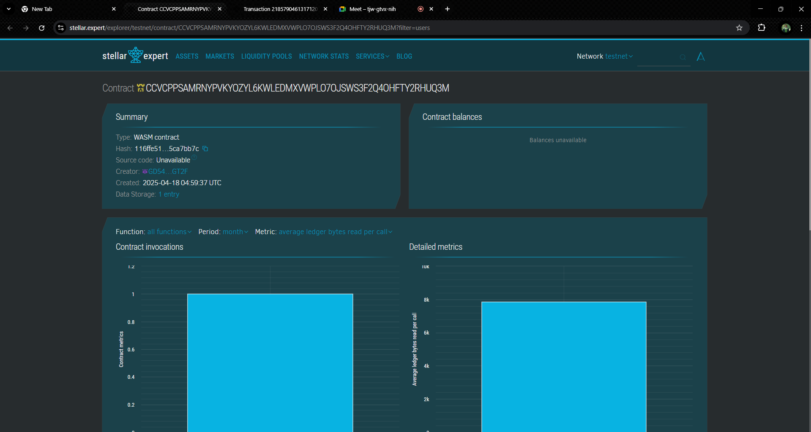

# Token Airdrop Distributor

## 📌 Project Title
**Token Airdrop Distributor**

## 📄 Project Description
The Token Airdrop Distributor is a lightweight Soroban-based smart contract that facilitates seamless and secure token distribution (airdrops) to a list of registered user. This contract ensures proper registration, claiming, and validation of airdrop entitlements.

## 🌟 Project Vision
To empower Web3 builders with a transparent and tamper-proof mechanism for distributing tokens during promotions, project launches, community rewards, and more—while ensuring that no user claims twice or is left out of the loop.

## ✨ Key Feature
- **Register Airdrop:** Admins can register a token airdrop for a user with specific token details.
- **Claim Airdrop:** Registered users can securely claim their token airdrops, preventing double-claims.
- **Status View:** Users can view the status of their airdrop (claimed or not).
- **Lightweight Design:** Minimal and gas-efficient contract structure optimized for performance on Soroban.

## 🔮 Future Scopes
- **Batch Airdrop Registration**
- **Expiration Timers for Claims**
- **Merkle Tree Integration for On-chain Verification**
- **Admin Controls and Multi-token Support**
- **UI Dashboard Integration (Frontend dApp)**

- Contract details CCVCPPSAMRNYPVKYOZYL6KWLEDMXVWPLO7OJSWS3F2Q4OHFTY2RHUQ3M

